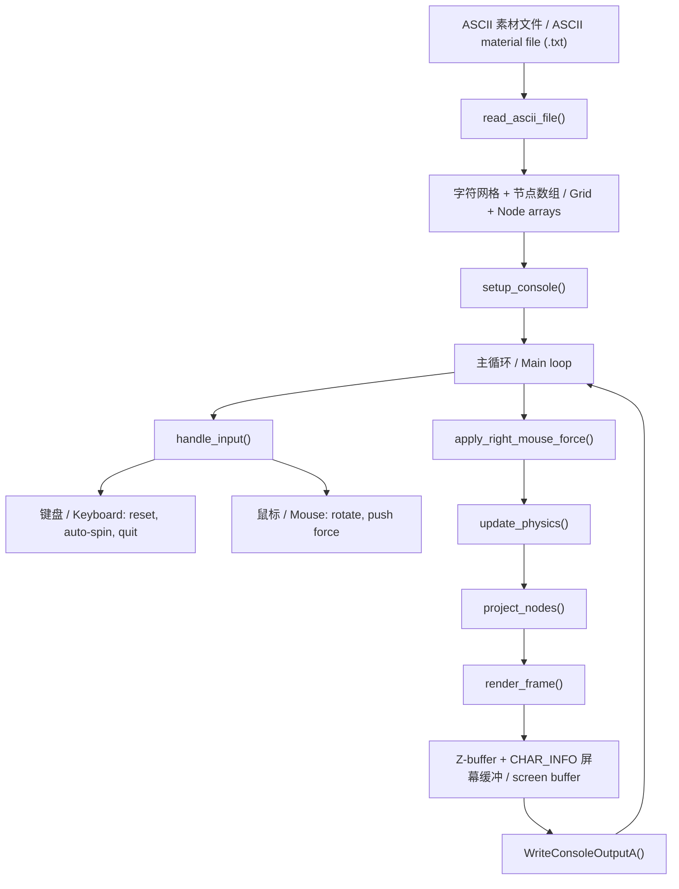

# ASCII 图片旋转 + 拖动引擎 / ASCII Image Rotate + Drag Engine

一个基于 Windows Console API 的 ASCII 图片交互渲染引擎。它可以在命令行里加载
ASCII 文本素材，并支持鼠标左键拖动旋转、鼠标右键拖动推开字符、松手后弹性回弹。
程序不创建 GUI 窗口，不依赖 SDL 或其他图形框架。

A Windows Console API based interactive renderer for ASCII image materials. It
loads ASCII text assets in a terminal, supports left-mouse drag rotation,
right-mouse push deformation, and spring-back recovery after release. It does
not open a GUI window and does not depend on SDL or other graphics frameworks.

## 文件 / Files

| 文件 / File | 说明 / Purpose |
| --- | --- |
| `ascii_rotate_push_console_win.c` | 主程序：Windows 控制台渲染、输入处理、旋转和弹性扰动逻辑。 / Main Windows console renderer, input handler, rotation logic, and elastic deformation engine. |
| `pure_ascii_face_finger_160col.txt` | 160 列 ASCII 素材，建议首次运行使用。 / 160-column ASCII material, recommended for the first run. |
| `pure_ascii_face_finger_220col.txt` | 220 列 ASCII 素材，建议配合较小缩放比例。 / 220-column ASCII material, recommended with a smaller zoom scale. |

## 编译 / Build

在 Windows 上使用 MinGW GCC 编译：

Build with MinGW GCC on Windows:

```powershell
gcc ascii_rotate_push_console_win.c -o ascii_rotate_push_console_win.exe -lm
```

程序使用 `windows.h` 和 Windows Console API，因此目标环境是 Windows Terminal、
`cmd.exe` 或兼容的 Windows 控制台。

The program uses `windows.h` and the Windows Console API, so it targets Windows
Terminal, `cmd.exe`, or compatible Windows console environments.

## 运行 / Run

推荐运行方式：

Recommended examples:

```powershell
.\ascii_rotate_push_console_win.exe .\pure_ascii_face_finger_160col.txt 35 1.00
.\ascii_rotate_push_console_win.exe .\pure_ascii_face_finger_220col.txt 35 0.72
```

参数说明：

Arguments:

| 参数 / Argument | 含义 / Meaning | 默认值或范围 / Default or Range |
| --- | --- | --- |
| `argv[1]` | ASCII 文本素材路径。 / ASCII text material path. | `pure_ascii_face_finger_160col.txt` |
| `argv[2]` | 每帧延迟，单位毫秒；越小越快。 / Frame delay in milliseconds; lower is faster. | 默认 `35`，限制为 `5..300`。 / Default `35`, clamped to `5..300`. |
| `argv[3]` | 渲染缩放比例。 / Render zoom scale. | 默认 `1.00`，限制为 `0.25..2.50`。 / Default `1.00`, clamped to `0.25..2.50`. |

## 操作 / Controls

| 输入 / Input | 动作 / Action |
| --- | --- |
| 鼠标左键拖动 / Left mouse drag | 旋转 ASCII 图片。 / Rotate the ASCII image. |
| 鼠标右键拖动 / Right mouse drag | 将字符从鼠标位置推开，松手后回弹。 / Push characters away from the cursor, then spring back after release. |
| `R` | 重置角度和扰动。 / Reset angle and deformation. |
| `Space` | 开关慢速自动旋转。 / Toggle slow automatic rotation. |
| `Q` 或 / or `Esc` | 退出程序。 / Exit. |

## 架构 / Architecture



运行时会把每个可见 ASCII 字符保存为一个节点。节点包含屏幕空间位移、速度、投影坐标
和深度信息。每一帧中，输入模块更新旋转角度或鼠标推力，物理模块让被推开的节点弹性
回到原位，投影模块把节点映射到控制台坐标，最后由 z-buffer 判断每个输出格子应该显示
哪个字符。

At runtime, each visible ASCII character is stored as a node. A node keeps its
screen-space offset, velocity, projected coordinate, and depth. On each frame,
the input layer updates rotation or mouse push force, the physics layer pulls
displaced nodes back toward their original positions, the projection layer maps
nodes into console coordinates, and the z-buffer decides which character should
be drawn in each output cell.

## 注意事项 / Notes

- 如果控制台窗口不够宽，建议先使用 160 列素材。 / If the console window is not very wide, start with the 160-column material.
- 使用 220 列素材时，建议缩放比例设为 `0.70` 到 `0.80`。 / For the 220-column material, use a zoom around `0.70` to `0.80`.
- 运行前尽量放大终端窗口，否则画面可能被裁剪。 / Enlarge the terminal window before running, otherwise the image may be clipped.
- 如果鼠标输入没有响应，建议尝试 Windows Terminal 或 `cmd.exe`，并关闭 QuickEdit Mode。 / If mouse input does not respond, try Windows Terminal or `cmd.exe`, and turn off QuickEdit Mode.
