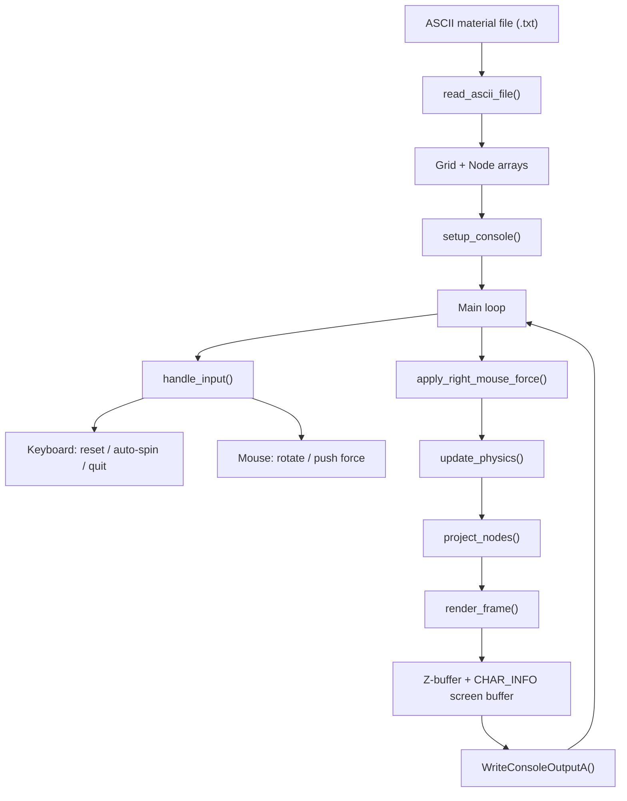

# ASCII Image Rotate + Drag Engine

Windows console engine for rendering ASCII image materials with mouse-driven
rotation and push-back deformation. It uses the Windows Console API directly,
so it does not open a GUI window and does not require SDL or other graphics
frameworks.

The repository description is: ASCII图片旋转+拖动引擎.

## Files

| File | Purpose |
| --- | --- |
| `ascii_rotate_push_console_win.c` | Main Windows console renderer and interaction engine. |
| `pure_ascii_face_finger_160col.txt` | 160-column ASCII material. Recommended first-run asset. |
| `pure_ascii_face_finger_220col.txt` | 220-column ASCII material. Use with smaller zoom. |

## Build

Use MinGW GCC on Windows:

```powershell
gcc ascii_rotate_push_console_win.c -o ascii_rotate_push_console_win.exe -lm
```

The program depends on `windows.h`, so it is intended for Windows console
environments such as Windows Terminal or `cmd.exe`.

## Run

Recommended examples:

```powershell
.\ascii_rotate_push_console_win.exe .\pure_ascii_face_finger_160col.txt 35 1.00
.\ascii_rotate_push_console_win.exe .\pure_ascii_face_finger_220col.txt 35 0.72
```

Arguments:

| Argument | Meaning | Default / Range |
| --- | --- | --- |
| `argv[1]` | ASCII text material path. | `pure_ascii_face_finger_160col.txt` |
| `argv[2]` | Frame delay in milliseconds. Lower is faster. | default `35`, clamped to `5..300` |
| `argv[3]` | Render zoom scale. | default `1.00`, clamped to `0.25..2.50` |

## Controls

| Input | Action |
| --- | --- |
| Left mouse drag | Rotate the ASCII image. |
| Right mouse drag | Push ASCII characters away from the cursor, then spring back after release. |
| `R` | Reset angle and deformation. |
| `Space` | Toggle slow automatic rotation. |
| `Q` or `Esc` | Exit. |

## Architecture



The runtime keeps each visible ASCII character as a node with screen-space
offset and velocity. Every frame, input updates rotation or push force, physics
pulls displaced nodes back toward their source positions, projection converts
nodes into console coordinates, and the z-buffer decides which character is
drawn at each output cell.

## Notes

- Start with the 160-column material if the console window is not very wide.
- For the 220-column material, use a zoom around `0.70` to `0.80`.
- Enlarge the terminal window before running; otherwise the rendered image may
  be clipped.
- If mouse input does not respond, try Windows Terminal or `cmd.exe`, and turn
  off QuickEdit Mode.
